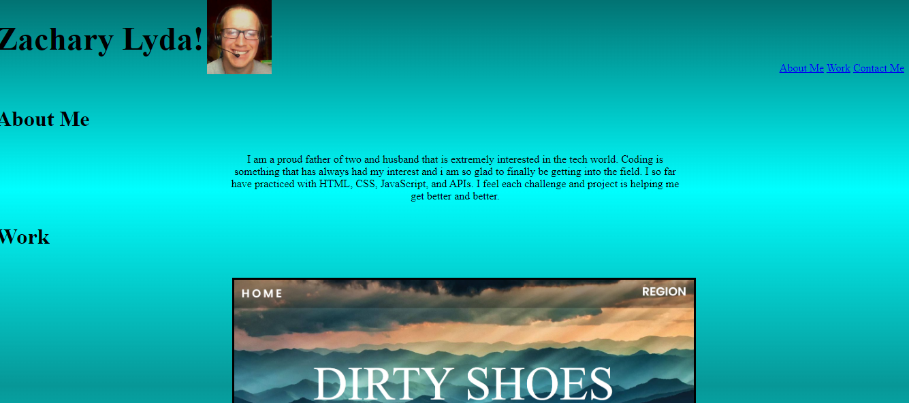

# Refactored-Tribble

# Steps

## I started with a rough template of an HTML.

## I then linked a CSS file.

## I created an h1 tag in the header with my name and used an image tag to link my photo. Also in the header is a section with anchor tags to help you navigate my portfolio page.

## In the main section I included three h2 tags that include about me and work.

## The about me includes a breif description about myself.

## The work section includes 3 anchor tags so i can link images with deployable links that will allow the user to click on each project and see what it looks like when it is opened in the browser.

## In the footer I have another h3 with contact me.

## I have a div below the h3 that inludes 5 p tags with different contact info.

## I used different classes and ids throughout the html to be targeted with in the css file to help style and position everything as i want it to be.

# What I learned

## I designed this website to showcase a portolio of my current work that i have achieved with the knowledge i have learned thus far.

## I hope to use this as a stepping stone to get better as creating an online portfolio to help promote myself to potential employers in the future as well as show off my work to anyone that were to ask me of my current endeavors.

## I was able to gain more insight on how to move and position elements such as images and text on a webpage using syntax sych as text-align and i also gained knowledge of how to place a gradient as the background for my website.

# Thanks

## A special thanks to Jacob Nordan during my tutoring sessions for helping me figure out some of my positioning issues and how to correct them.

# Deployed Link

##  https://zlyda1993.github.io/refactored-tribble/

# Screenshot of deployed link

## 
